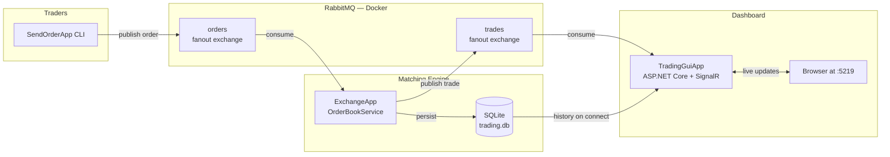

# XYZ Exchange — Multi-stock Trading System

A distributed message-driven stock exchange built on RabbitMQ. Traders submit orders via a CLI; an exchange engine matches orders against an in-memory order book and persists completed trades to SQLite; a real-time browser dashboard subscribes to live updates via SignalR.

Multiple stocks trade in parallel through isolated order books. Trade history survives application restarts. The dashboard updates without page refresh.

Built for **PBT205 — Project-based Learning Studio: Technology** at Torrens University Australia.

---

## Architecture



Three command-line applications and one web app, communicating exclusively through the broker. No direct connections between components — each can be stopped and started independently.

---

## Quick start

**Prerequisites:** Docker Desktop, .NET 10 SDK.

```bash
git clone https://github.com/daveinciii/pbt205-xyz-exchange.git
cd pbt205-xyz-exchange
docker compose up -d
```

The dashboard is now live at **http://localhost:5219**.

In a second terminal, fire a matching pair to see the dashboard react:

```bash
dotnet run --project SendOrderApp -- Tia localhost XYZ BUY 100 50.00
dotnet run --project SendOrderApp -- David localhost XYZ SELL 100 50.00
```

The XYZ tile populates with `$50.00`, the trade appears in the recent-trades list, and the trade is persisted to SQLite.

---

## Components

| Project | Purpose |
|---|---|
| `SendOrderApp` | CLI — publishes a single order and exits |
| `ExchangeApp` | Long-running matching engine with SQLite persistence |
| `TradingGuiApp` | ASP.NET Core dashboard at `:5219` |
| `TradingCore` | Shared library — models, services, configuration |
| `TradingCore.Tests` | xUnit test suite for `OrderBookService` |

---

## Submitting orders

```bash
dotnet run --project SendOrderApp -- <username> <endpoint> <stock> <BUY|SELL> 100 <price>
```

| Argument | Description | Example |
|---|---|---|
| `username` | Trader identifier | `Tia` |
| `endpoint` | RabbitMQ host (port defaults to `5672`) | `localhost` or `localhost:5672` |
| `stock` | Stock symbol (must be in the configured list) | `XYZ`, `ABC`, or `DEF` |
| `side` | `BUY` or `SELL` | `BUY` |
| `quantity` | Fixed at 100 per assessment spec | `100` |
| `price` | Desired price per share | `10.50` |

If the buyer's price is acceptable to the seller (or vice versa), the exchange executes the trade and publishes it to the `trades` exchange. Unmatched orders sit in the order book until a counter-offer arrives.

Example matching pair:

```bash
dotnet run --project SendOrderApp -- Alice localhost XYZ BUY 100 10.50
dotnet run --project SendOrderApp -- Bob   localhost XYZ SELL 100 10.20
```

The exchange terminal will print a `TRADE EXECUTED` box, and the dashboard will update live.

---

## Verifying persistence

Trade history survives an `ExchangeApp` restart. To verify:

```bash
# 1. Submit one or more matching pairs (orders matched, trades persisted)
dotnet run --project SendOrderApp -- Alice localhost XYZ BUY 100 10.50
dotnet run --project SendOrderApp -- Bob   localhost XYZ SELL 100 10.20

# 2. Stop ExchangeApp (Ctrl+C in its terminal — or restart its container)
docker compose restart exchange

# 3. Refresh the dashboard at :5219
```

The dashboard will continue to show the previous trade — served from SQLite via the `TradeHub.GetHistory()` method. On startup, `ExchangeApp` logs the count of historical trades loaded from the database in its `DATABASE` box.

---

## Configuration

Every configurable value is sourced from a configuration file or startup argument. The repository contains no hardcoded environment values.

| Setting | Source | Default |
|---|---|---|
| Supported stocks | `tradingsystem.config.json` (root) → `Stocks` | `["XYZ", "ABC", "DEF"]` |
| RabbitMQ endpoint | CLI argument to each app | `localhost:5672` |
| Database path | `appsettings.json` → `Database:Path` | `trading.db` |
| Dashboard port | `appsettings.json` → ASP.NET Core `Urls` | `5219` |

To add a new stock symbol, edit `tradingsystem.config.json` and restart `ExchangeApp` — `SendOrderApp` validates against the configured list at submission time, so adding `GHI` makes it immediately tradeable across all components.

---

## Running tests

```bash
dotnet test
```

The `TradingCore.Tests` project covers the matching engine — buy/sell with no match (added to book), buy at price ≥ sell (trade executed), per-stock isolation (orders for stock A do not match against stock B), and matched-order removal from the book.

---

## Topics

| Exchange | Type | Description |
|---|---|---|
| `orders` | fanout | `SendOrderApp` publishes orders here; `ExchangeApp` subscribes |
| `trades` | fanout | `ExchangeApp` publishes completed trades here; `TradingGuiApp` subscribes |

Both exchanges are declared `durable: true` so they survive a broker restart. Subscriber queues are exclusive and auto-delete — each subscriber gets its own copy of every message.

---

## Docker services

| Service | Port | Description |
|---|---|---|
| RabbitMQ | `5672` | AMQP for app-to-broker traffic |
| RabbitMQ Management | `15672` | Web UI (login: `guest` / `guest`) |
| ExchangeApp | — | Matching engine, no exposed port |
| TradingGuiApp | `5219` | Dashboard |
| SQLite volume | — | Mounted to persist `trading.db` across `docker compose down` |

---

## Project structure

```
pbt205-xyz-exchange/
├── tradingsystem.config.json        # configurable stock list
├── docker-compose.yml               # one-command orchestration
├── TradingCore/
│   ├── Cli/
│   │   └── ConsoleUi.cs             # boxed terminal output
│   ├── Configuration/
│   │   └── StockConfig.cs           # stock list loader + validator
│   ├── Models/
│   │   ├── Order.cs
│   │   ├── Trade.cs
│   │   └── OrderSide.cs
│   ├── Services/
│   │   ├── OrderBookService.cs      # matching engine
│   │   └── RabbitMQService.cs       # AMQP wrapper
│   ├── Persistence/
│   │   ├── TradingDbContext.cs      # EF Core context
│   │   └── TradeRecord.cs           # entity
│   └── Migrations/                  # EF Core migrations
├── TradingCore.Tests/               # xUnit tests
├── SendOrderApp/                    # trader CLI
├── ExchangeApp/                     # matching + persistence
├── TradingGuiApp/                   # ASP.NET Core dashboard
│   ├── Hubs/
│   │   └── TradeHub.cs              # SignalR hub
│   ├── Services/
│   │   ├── TradeListenerService.cs  # broker → SignalR bridge
│   │   └── TradeHistory.cs          # in-memory ring buffer
│   └── wwwroot/
│       └── index.html               # multi-stock dashboard
└── evidence/                        # test screenshots and results
    ├── test-results.md
    └── *.png
```

---

## Schemas

**Order** — published to the `orders` exchange:

```csharp
public class Order
{
    public string Username { get; set; }
    public string Stock { get; set; }     // validated against StockConfig
    public OrderSide Side { get; set; }   // BUY or SELL
    public int Quantity { get; set; }     // fixed at 100
    public double Price { get; set; }
    public DateTime CreatedAt { get; set; }
}
```

**Trade** — published to the `trades` exchange and persisted to SQLite:

```csharp
public class Trade
{
    public string Stock { get; set; }
    public string Buyer { get; set; }
    public string Seller { get; set; }
    public int Quantity { get; set; }
    public double Price { get; set; }
    public DateTime ExecutedAt { get; set; }
}
```

---

## Stack

- **C#** / **.NET 10**
- **RabbitMQ** 3 (Docker, fanout exchanges)
- **Entity Framework Core** + **SQLite** for trade persistence
- **ASP.NET Core** + **SignalR** for the dashboard
- **Newtonsoft.Json** for message serialisation
- **xUnit** for unit testing
- **Docker Compose** for local orchestration

---

## Known limitations

- **Dashboard stock list is hardcoded.** The `STOCKS` array in `wwwroot/index.html` lists `["XYZ", "ABC", "DEF"]` directly. A `GetStocks()` hub method is the cleaner solution and is documented inline as a TODO at the relevant call-site.
- **Order book visibility (FR-08) and trading analytics (FR-09) are not implemented.** Both were classified as Could-have stretch features in the Assessment 2 plan and were deprioritised in favour of completing all Must and Should requirements with full test coverage.
- **No reconnection logic on `SendOrderApp`.** If the broker is unavailable when an order is submitted, the publish throws a `BrokerUnreachableException`. `TradingGuiApp` and `ExchangeApp` both handle this gracefully (5 retry attempts with backoff), but the trader CLI is intentionally fire-and-exit per assessment spec.

---

## Documentation

- **Assessment 3 Report** — see `PBT205_A3_Report.pdf` (link to be added once finalised)
- **Demo video** — see `PBT205_A3_Demo.mp4` (link to be added once recorded)
- **Test results** — see [`evidence/test-results.md`](evidence/test-results.md)

---

## Team — PBT205 Group 3

- **Tia Darvell** — A00029275
- **David Ristevski** — A00072295
- **Nicholas Beltran** — A00158506

Submitted to **Fahad Hameed**, Torrens University Australia.